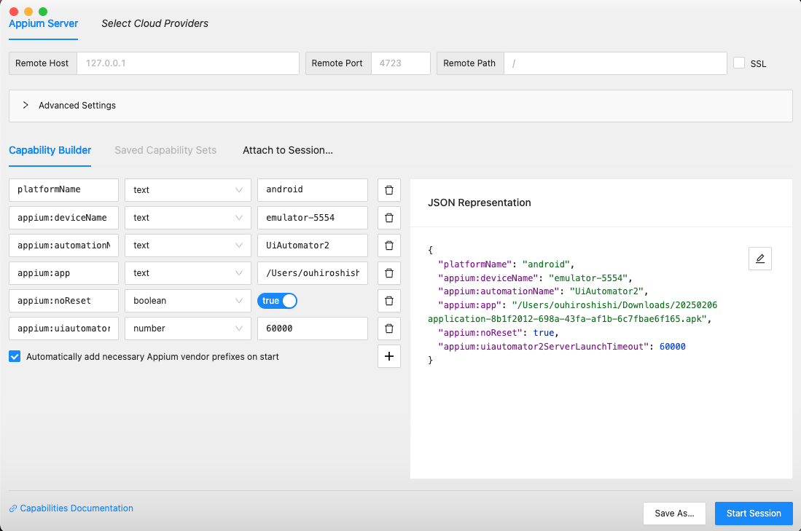

<div align="center">

# 📱 GoGoX App Flutter Appium E2E Testing

[]()
[]()
[]()
[]()
[]()
[]()

**Language**: [English](README.MD) | [中文](README_zh.md)

*Comprehensive end-to-end testing framework for GoGoX logistics app with BDD support, multi-platform testing, and cloud integration*

</div>

## 📖 Project Overview

This is a comprehensive end-to-end testing framework for **GoGoX** - a leading logistics and delivery application, using **Appium**, **pytest-bdd** for behavior-driven development, supporting multiple platforms (Android, iOS) with both local and cloud testing capabilities.

### 🚚 About GoGoX App

GoGoX is a comprehensive logistics platform that connects users with delivery services, offering instant delivery solutions for various needs including:

- **Instant Delivery**: Quick and reliable delivery services
- **Multi-Service Selection**: Choose from various delivery options
- **Best Price Guarantee**: Competitive pricing for all services
- **Reliable Service**: Trusted delivery partners
- **Easy Order Placement**: Simple and intuitive ordering process

<div align="center">
  
  
  
  
  
</div>

### 🌟 Key Features
- **Multi-Platform Support**: Android, iOS  testing
- **BDD Framework**: Gherkin syntax with pytest-bdd
- **Page Object Model**: Clean, maintainable test architecture
- **Cloud Integration**: BrowserStack support for scalable testing
- **Comprehensive Reporting**: Allure reports with visual evidence


### 🏗️ Architecture
```
flutter-appium-automation/
├── features/           # BDD Gherkin scenarios for GoGoX app
│   ├── android/           # Android app features 
│   └── ios/         # iOS features 
├── pages/             # Page Object Model for GoGoX app
│   ├── android/           # Android page objects
│   ├── ios/         # iOS page objects
│   └── common/  # Common functionality
├── tests/             # Test step implementations 
│   └── steps/         # BDD step definitions
├── utils/             # Helper utilities and configurations
├── images/            # GoGoX app screenshots and assets
│   └── assets/        # App feature screenshots
└── screenshots/       # Test evidence storage
```

# 📋 Table of Contents

- [📱 GoGoX App Flutter Appium E2E Testing](#-gogox-app-flutter-appium-e2e-testing)
  - [📖 Project Overview](#-project-overview)
    - [🚚 About GoGoX App](#-about-gogox-app)
    - [🌟 Key Features](#-key-features)
    - [🏗️ Architecture](#️-architecture)
- [📋 Table of Contents](#-table-of-contents)
- [💻 System Requirements](#-system-requirements)
    - [Required Software](#required-software)
- [🔧 Installation \& Setup](#-installation--setup)
  - [1. Appium Setup](#1-appium-setup)
  - [2. Environment Configuration](#2-environment-configuration)
    - [Create Environment File](#create-environment-file)
    - [Key Environment Variables](#key-environment-variables)
  - [Command Line Interface (CLI)](#command-line-interface-cli)
    - [Available Options](#available-options)
    - [CLI Examples](#cli-examples)
  - [3. WebDriverAgent Setup (iOS Only)](#3-webdriveragent-setup-ios-only)
- [🚀 Quick Start](#-quick-start)
  - [Local Testing](#local-testing)
    - [1. Start Appium Server](#1-start-appium-server)
    - [2. Run Tests](#2-run-tests)
  - [BrowserStack Cloud Testing](#browserstack-cloud-testing)
- [⚡ Test Execution](#-test-execution)
  - [Basic Commands](#basic-commands)
  - [Platform-Specific Testing](#platform-specific-testing)
- [📊 Reporting \& Analysis](#-reporting--analysis)
  - [Allure Reports](#allure-reports)
  - [Report Features](#report-features)
  - [HTML Reports](#html-reports)
- [🔍 Element Inspection Tools](#-element-inspection-tools)
    - [Appium Inspector](#appium-inspector)
      - [App (Android) Configuration](#app-android-configuration)
      - [iOS (ios Real Device) Configuration](#ios-ios-real-device-configuration)
    - [Using Appium Inspector](#using-appium-inspector)
    - [uiauto.dev Tool](#uiautodev-tool)
      - [Prerequisites](#prerequisites)
      - [Installation](#installation)
      - [Launch Methods](#launch-methods)
      - [Key Features](#key-features)
      - [Configuration Steps](#configuration-steps)
      - [Using uiauto.dev](#using-uiautodev)
- [📱 Device Configuration](#-device-configuration)
    - [Find Device UDID](#find-device-udid)
- [🛠️ Troubleshooting](#️-troubleshooting)
  - [Common Issues](#common-issues)
    - [Feature File Path Errors](#feature-file-path-errors)
    - [Element Not Found](#element-not-found)
    - [Appium Connection Issues](#appium-connection-issues)
    - [BrowserStack Issues](#browserstack-issues)
  - [Platform-Specific Troubleshooting](#platform-specific-troubleshooting)
    - [Android](#android)
    - [iOS](#ios)
  - [Debug Commands](#debug-commands)
- [📚 References](#-references)

# 💻 System Requirements

### Required Software

| Software       | Version         | Purpose                    |
| -------------- | --------------- | -------------------------- |
| **Python**     | 3.8+            | Test framework & scripts   |
| **Node.js**    | Latest LTS      | Appium server runtime     |
| **Xcode**      | 15.4+           | iOS testing         |
| **Android Studio** | Koala 2024.1.1+ | Android testing        |
| **Git**        | Latest          | Version control           |

# 🔧 Installation & Setup

## 1. Appium Setup

```bash
# Install Appium globally
npm install -g appium

# Install platform-specific drivers
appium driver install uiautomator2  # Android
appium driver install xcuitest      # iOS

# Install Python dependencies
python3 -m pip install -r requirements.txt
```

## 2. Environment Configuration

### Create Environment File
Copy `.env.example` to `.env` and configure:

```bash
# ===== Basic Test Configuration =====
# Platform setting (android for Android, ios for ios)
APPIUM_OS="android"

# Wait time settings (seconds)
IMPLICIT_WAIT=25

# Application state control
NO_RESET="True"
AUTO_ACCEPT_ALERTS="True"

# ===== Environment Settings =====
# Test runner (local, browserstack)
TEST_RUNNER="local"

# App environment (dev, staging, production)
APPIUM_ENV="staging"


# ===== Environment-Specific App Paths =====
# Android APK paths (different environments)
ANDROID_APP_PATH_DEV="/path/to/your/dev.apk"
ANDROID_APP_PATH_STAGING="/path/to/your/staging.apk"
ANDROID_APP_PATH_PRODUCTION="/path/to/your/production.apk"

# iOS app paths (different environments, .app for simulator, .ipa for device)
IOS_APP_PATH_DEV="/path/to/your/dev.ipa"
IOS_APP_PATH_STAGING="/path/to/your/staging.ipa"
IOS_APP_PATH_PRODUCTION="/path/to/your/production.ipa"

# ===== Application IDs =====
APP_ID_DEV="com.yourapp.appname.dev"
APP_ID_STAGING="com.yourapp.appname.staging"
APP_ID_PRODUCTION="com.appname.production"


# ===== iOS REAL DEVICE use =====
# only real ios device connect required
IOS_UUID="00008110-0010648C1152801E" # changed to your own device
IOS_DEVICE_IDENTIFIER="C06E799B-7528-4166-9F7D-38031E491386" # changed to your own device


# ===== BrowserStack Configuration (Optional) =====
BROWSERSTACK_USERNAME="your-username"
BROWSERSTACK_ACCESS_KEY="your-access-key"
BROWSERSTACK_HUB_URL="https://hub-cloud.browserstack.com/wd/hub"

# Environment-specific BrowserStack app IDs
BROWSERSTACK_APP_ID_DEV="bs://your-dev-app-id"
BROWSERSTACK_APP_ID_STAGING="bs://your-staging-app-id"
BROWSERSTACK_APP_ID_PRODUCTION="bs://your-production-app-id"

# BrowserStack project settings
BROWSERSTACK_PROJECT_NAME="Flutter App Local Development"
BROWSERSTACK_BUILD_NAME="Local Build"
BROWSERSTACK_SESSION_NAME="Local Test Session"
```

### Key Environment Variables
- **APPIUM_OS**: Target platform (`android` for Android, `ios` for iOS)
- **NO_RESET**: Preserve app state between tests
- **AUTO_ACCEPT_ALERTS**: Automatically handle system permission dialogs
- **IMPLICIT_WAIT**: Element wait timeout (default: 25 seconds)
- **APPIUM_ENV**: App environment (staging,dev, production)
- **API_ENVIRONMENT**: Backend environment for API testing
- **TEST_RUNNER**: Test runner type (local, browserstack)

## Command Line Interface (CLI)

The framework provides comprehensive CLI options for flexible test execution:

### Available Options

```bash
# Platform Selection
--platform {android,ios}    # Specify target platform (default: ios)

# Test Runner Selection  
--runner {local,browserstack}      # Choose test runner (default: local)

# Environment Selection
--env {staging,dev,production}  # Set app environment (default: staging)

# Setup Control
--skipsetup                       # Skip app reinstallation and initialization

# Standard pytest options
-v, --verbose                     # Verbose output
-s                               # Capture output
-m MARKEXPR                      # Run tests with specific markers
-k EXPRESSION                    # Run tests matching expression
--lf                            # Rerun last failed tests
--alluredir=DIR                 # Generate Allure report
```

### CLI Examples

```bash
# Basic usage
pytest                           # Default: local, android, staging
pytest -v                        # Verbose output

# Platform-specific testing
pytest --platform android        # Android testing
pytest --platform ios           # iOS testing

# Environment testing
pytest --env staging            # Staging environment
pytest --env dev                # dev environment
pytest --env production        # Production environment

# Cloud testing
pytest --runner browserstack   # BrowserStack cloud testing

# Skip setup (for faster testing)
pytest --skipsetup             # Skip app reinstallation

# Combined options
pytest --runner browserstack --platform ios --env production
pytest --platform android --env staging --skipsetup -v
pytest --runner browserstack --env staging --alluredir=./allure-results

```

## 3. WebDriverAgent Setup (iOS Only)

1. Clone [WebDriverAgent](https://github.com/appium/WebDriverAgent)

```bash
git clone https://github.com/appium/WebDriverAgent
```

2. Open WebDriverAgent.xcodeproj in Xcode
3. Select WebDriverAgentRunner and run tests

# 🚀 Quick Start

## Local Testing

### 1. Start Appium Server
```bash
# Start Appium server
appium

# Or specify custom port
appium -p 4723
```

After starting Appium, you should see:


### 2. Run Tests
```bash
# Run all tests
pytest -v

# Run specific platform tests
pytest tests/steps/app/          # Android tests
pytest tests/steps/ios/        # ios tests

# Run with markers
pytest -m login                  # Login tests only
pytest -m regression            # Regression suite
```

## BrowserStack Cloud Testing

```bash
# Set BrowserStack environment
export TEST_RUNNER_ENVIRONMENT="browserstack"

# Configure credentials in .env
BROWSERSTACK_USERNAME="your-username"
BROWSERSTACK_ACCESS_KEY="your-access-key"
BROWSERSTACK_APP_ID="bs://your-app-id"

# Run cloud tests
pytest -v
```

# ⚡ Test Execution

## Basic Commands

```bash
# Run all tests
pytest

# Verbose output
pytest -v -s

# Run specific test file
pytest tests/steps/app/test_02login_steps.py

# Run with specific markers
pytest -m login
pytest -m navigation
pytest -m regression

# Run by keyword
pytest -k "login_invalid_email"
```

## Platform-Specific Testing

```bash
# App (Android) tests only
pytest tests/steps/app/

# iOS tests only
pytest tests/steps/ios/

## BDD Feature Testing

```bash
# Run specific feature tests
pytest tests/steps/ios/test_login_steps.py -v
pytest tests/steps/android/test_onboarding_steps.py -v

# Navigation features
pytest -k "navigation" -v

# Creation workflows
pytest -k "create" -v

# Settings and configuration
pytest -k "setting" -v
```


# 📊 Reporting & Analysis

## Allure Reports

```bash
# Generate reports during test run
pytest --alluredir=./allure-results

# Generate static HTML report
allure generate allure-results -o allure-report --clean

# Start interactive report server
allure serve allure-results
```

## Report Features
- **Test Results Overview**: Pass/fail statistics
- **Execution Timeline**: Test duration analysis  
- **Screenshots**: Visual evidence on failures
- **Logs**: Detailed execution traces
- **Trends**: Historical test performance
- **Categories**: Organized by test types

## HTML Reports

```bash
# Generate HTML report
pytest --html=reports/report.html

# Self-contained report
pytest --html=reports/report.html --self-contained-html
```

# 🔍 Element Inspection Tools

### Appium Inspector

- Download Appium Inspector
- Configure Appium Server
- Start Appium Server
- Launch Appium Inspector
- Configure Desired Capabilities

#### App (Android) Configuration

```json
{
  "platformName": "app",
  "appium:deviceName": "emulator-5554",
  "appium:automationName": "UiAutomator2",
  "appium:platformVersion": "13",
  "appium:app": "/path/to/your/app.apk",
  "appium:noReset": true,
  "appium:autoGrantPermissions": true,
  "appium:uiautomator2ServerLaunchTimeout": 60000
}
```

#### iOS (ios Real Device) Configuration

```json
{
  "platformName": "iOS",
  "appium:deviceName": "iPhone 15 Pro",
  "appium:platformVersion": "17.5",
  "appium:automationName": "XCUITest",
  "appium:noReset": true,
  "appium:autoAcceptAlerts": true,
  "appium:udid": "00008110-0010648C1152801E"
}
```

### Using Appium Inspector

<div align="center">
  
</div>

### uiauto.dev Tool

[uiauto.dev](https://uiauto.dev/) is a powerful web-based tool for inspecting mobile app elements. It provides a more user-friendly interface compared to Appium Inspector and supports both Android and iOS platforms.

#### Prerequisites

- Python 3.8 or higher
- Appium server running locally

#### Installation

```bash
# Install uiauto.dev
pip3 install -U uiautodev
```

#### Launch Methods

```bash
# Method 1: Direct command
uiauto.dev

# Method 2: Python module
python3 -m uiautodev
```

#### Key Features

- Web-based interface (no installation required)
- Real-time element inspection
- Support for both Android and iOS
- Element hierarchy visualization
- XPath and accessibility ID generation
- Screenshot capture and element highlighting

#### Configuration Steps

1. Start your Appium server
2. Connect your device or emulator
3. Configure the desired capabilities

#### Using uiauto.dev

1. Enter your Appium server URL (default: http://localhost:4723)
2. Configure the desired capabilities
3. Click "Start Session"
4. Use the interface to:
   - Inspect elements
   - Generate locators
   - Take screenshots
   - View element hierarchy

<div align="center">
  
</div>

# 📱 Device Configuration

### Find Device UDID

```bash
# iOS Simulator
xcrun simctl list devices

# iOS Real Device
xcrun xctrace list devices

# Android
adb devices
```

# 🛠️ Troubleshooting

## Common Issues

### Feature File Path Errors
**Error**: `FileNotFoundError: No such file or directory`

**Solutions**:
- Verify relative paths in step files
- Run pytest from project root directory
- Check file existence with `ls -la`

### Element Not Found
**Error**: `NoSuchElementException`

**Solutions**:
- Increase `IMPLICIT_WAIT` in .env
- Use explicit waits in page objects
- Update locators with Appium Inspector
- Check app UI changes

### Appium Connection Issues
**Error**: `Unable to connect to Appium server`

**Solutions**:
- Start Appium server: `appium`
- Check server URL in configuration
- Verify device connection: `adb devices` (Android)

### BrowserStack Issues
- Verify credentials in .env file
- Check app upload status
- Review session limits in account

## Platform-Specific Troubleshooting

### Android
```bash
# Restart ADB daemon
adb kill-server && adb start-server

# Clear app data
adb uninstall com.your.package.name
```

### iOS
- Trust developer certificate on device
- Ensure proper app signing
- Reset iOS Simulator if needed

## Debug Commands

```bash
# Verbose test output
pytest -v -s tests/steps/app/test_failing_test.py

# Enable Appium logs
appium --log-level debug

# Check connected devices
adb devices              # Android
xcrun simctl list devices  # iOS Simulator
xcrun xctrace list devices # iOS Real Device
```

# 📚 References

- [Appium Documentation](https://appium.io/docs/en/latest/)
- [pytest-bdd Documentation](https://pytest-bdd.readthedocs.io/)
- [UIAutomator2 Driver](https://github.com/appium/appium-uiautomator2-driver)
- [XCUITest Driver](https://github.com/appium/appium-xcuitest-driver)
- [BrowserStack Appium](https://www.browserstack.com/docs/app-automate/appium)
- [Page Object Model Pattern](https://selenium-python.readthedocs.io/page-objects.html)

---


<details>
<summary>WebDriverAgent Installation Failed</summary>

1. Check the following:

- Verify Xcode command line tools installation
- Rebuild WebDriverAgent in Xcode
- Check signing certificates
</details>

<details>
<summary>Android Device Not Detected</summary>

1. Check the following:

- Verify ADB installation
- Enable USB debugging
- Check USB connection
</details>

<details>
<summary>Appium Server Connection Issues</summary>

1. Check the following:

- Verify port configuration
- Check server permissions
- Review server logs
</details>

---
