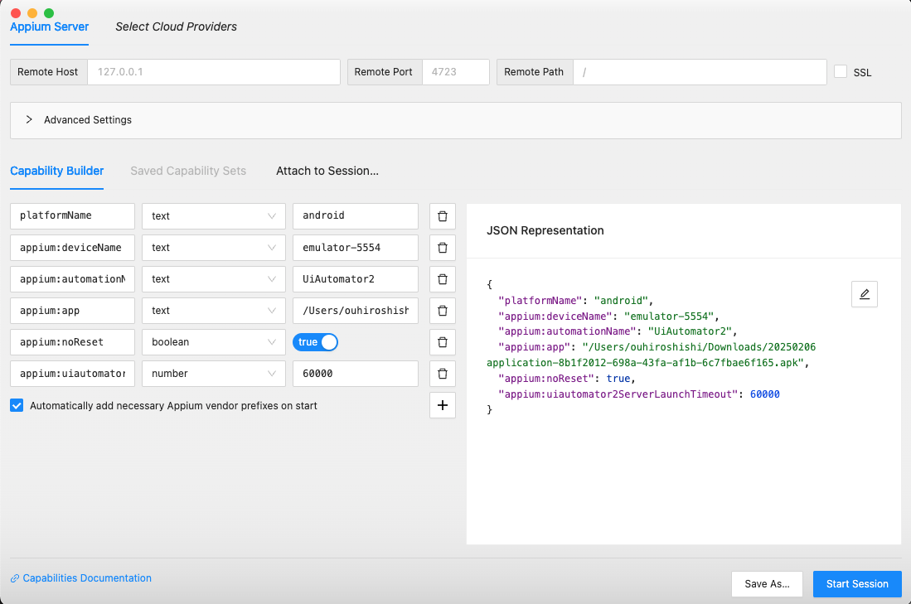

<div align="center">

# 📱 GoGoX App Appium E2E 自動化測試

[]()
[]()
[]()
[]()
[]()
[]()

**Language**: [English](README.MD) | [中文](README_zh.md)

*GoGoX 物流應用程式的綜合性端到端測試框架，具有 BDD 支持、多平台測試和雲端整合*

</div>

## 📖 專案概述

這是一個綜合性的 **GoGoX** 物流配送應用程式端到端測試框架，使用 **Appium**、**pytest-bdd** 實現行為驅動開發，支援多平台（Android、iOS）本地和雲端測試功能。

### 🚚 關於 GoGoX App

GoGoX 是一個綜合性物流平台，連接用戶與配送服務，為各種需求提供即時配送解決方案，包括：

- **即時配送**: 快速可靠的配送服務
- **多服務選擇**: 從各種配送選項中選擇
- **最佳價格保證**: 所有服務的競爭性定價
- **可靠服務**: 值得信賴的配送合作夥伴
- **簡易下單**: 簡單直觀的訂單流程

<div align="center">
  
  
  
  
  
</div>

### 🌟 主要特色
- **多平台支援**: Android、iOS 測試
- **BDD 框架**: 使用 pytest-bdd 的 Gherkin 語法
- **頁面物件模式**: 簡潔、可維護的測試架構
- **雲端整合**: BrowserStack 支持可擴展測試
- **全面報告**: 具有視覺證據的 Allure 報告

### 🏗️ 架構
```
app-appium-automation/
├── features/           # GoGoX app 的 BDD Gherkin 場景
│   ├── android/           # Android 應用程式功能
│   └── ios/         # iOS 功能
├── pages/             # GoGoX app 的頁面物件模式
│   ├── android/           # Android 頁面物件
│   ├── ios/         # iOS 頁面物件
│   └── common/  # 共同功能
├── tests/             # 測試步驟實現
│   └── steps/         # BDD 步驟定義
├── utils/             # 輔助工具和配置
├── images/            # GoGoX app 截圖和資源
│   └── assets/        # App 功能截圖
└── screenshots/       # 測試證據存儲
```

# 📋 目錄

- [📱 GoGoX App Appium E2E 自動化測試](#-gogox-app-appium-e2e-自動化測試)
  - [📖 專案概述](#-專案概述)
    - [🚚 關於 GoGoX App](#-關於-gogox-app)
    - [🌟 主要特色](#-主要特色)
    - [🏗️ 架構](#️-架構)
- [📋 目錄](#-目錄)
- [💻 系統需求](#-系統需求)
    - [必需軟體](#必需軟體)
- [🔧 安裝指南](#-安裝指南)
  - [1. Appium 設定](#1-appium-設定)
  - [2. 環境配置](#2-環境配置)
    - [建立環境檔案](#建立環境檔案)
    - [主要環境變數](#主要環境變數)
  - [命令行介面 (CLI)](#命令行介面-cli)
    - [可用選項](#可用選項)
    - [CLI 範例](#cli-範例)
  - [3. WebDriverAgent 設定（僅限 iOS）](#3-webdriveragent-設定僅限-ios)
- [🚀 快速開始](#-快速開始)
  - [本地測試](#本地測試)
    - [1. 啟動 Appium 伺服器](#1-啟動-appium-伺服器)
    - [2. 執行測試](#2-執行測試)
  - [BrowserStack 雲端測試](#browserstack-雲端測試)
- [⚡ 測試執行](#-測試執行)
  - [基本命令](#基本命令)
  - [平台特定測試](#平台特定測試)
- [📊 報告與分析](#-報告與分析)
  - [Allure 報告](#allure-報告)
  - [報告功能](#報告功能)
  - [HTML 報告](#html-報告)
- [🔍 元素檢查工具](#-元素檢查工具)
    - [Appium Inspector](#appium-inspector)
      - [App (Android) 配置](#app-android-配置)
      - [iOS (iOS 實體設備) 配置](#ios-ios-實體設備-配置)
    - [使用 Appium Inspector](#使用-appium-inspector)
    - [uiauto.dev 工具](#uiautodev-工具)
      - [前置條件](#前置條件)
      - [安裝](#安裝)
      - [啟動方法](#啟動方法)
      - [主要功能](#主要功能)
      - [配置步驟](#配置步驟)
      - [使用 uiauto.dev](#使用-uiautodev)
- [📱 設備配置](#-設備配置)
    - [查找設備 UDID](#查找設備-udid)
- [🛠️ 疑難排解](#️-疑難排解)
  - [常見問題](#常見問題)
    - [功能檔案路徑錯誤](#功能檔案路徑錯誤)
    - [找不到元素](#找不到元素)
    - [Appium 連接問題](#appium-連接問題)
    - [BrowserStack 問題](#browserstack-問題)
  - [平台特定疑難排解](#平台特定疑難排解)
    - [Android](#android)
    - [iOS](#ios)
  - [除錯命令](#除錯命令)
- [📚 參考資料](#-參考資料)

# 💻 系統需求

### 必需軟體

| 軟體           | 版本            | 用途                     |
| -------------- | --------------- | -------------------------- |
| **Python**     | 3.8+            | 測試框架和腳本         |
| **Node.js**    | Latest LTS      | Appium 伺服器運行環境     |
| **Xcode**      | 15.4+           | iOS 測試            |
| **Android Studio** | Koala 2024.1.1+ | Android 測試            |
| **Git**        | Latest          | 版本控制                |

# 🔧 安裝指南

## 1. Appium 設定

```bash
# 全域安裝 Appium
npm install -g appium

# 安裝平台專用驅動程式
appium driver install uiautomator2  # Android
appium driver install xcuitest      # iOS

# 安裝 Python 相依套件
python3 -m pip install -r requirements.txt
```

## 2. 環境配置

### 建立環境檔案
複製 `.env.example` 到 `.env` 並配置：

```bash
# ===== 基本測試配置 =====
# 平台設定 (android 用於 Android, ios 用於 iOS)
APPIUM_OS="android"

# 等待時間設定 (秒)
IMPLICIT_WAIT=25

# 應用程式狀態控制
NO_RESET="True"
AUTO_ACCEPT_ALERTS="True"

# ===== 環境設定 =====
# 測試執行器 (local, browserstack)
TEST_RUNNER="local"

# 應用程式環境 (dev, staging, production)
APPIUM_ENV="staging"

# ===== 環境特定應用程式路徑 =====
# Android APK 路徑 (不同環境)
ANDROID_APP_PATH_DEV="/path/to/your/dev.apk"
ANDROID_APP_PATH_STAGING="/path/to/your/staging.apk"
ANDROID_APP_PATH_PRODUCTION="/path/to/your/production.apk"

# iOS 應用程式路徑 (不同環境, .app 用於模擬器, .ipa 用於設備)
IOS_APP_PATH_DEV="/path/to/your/dev.ipa"
IOS_APP_PATH_STAGING="/path/to/your/staging.ipa"
IOS_APP_PATH_PRODUCTION="/path/to/your/production.ipa"

# ===== 應用程式 ID =====
APP_ID_DEV="com.yourapp.appname.dev"
APP_ID_STAGING="com.yourapp.appname.staging"
APP_ID_PRODUCTION="com.appname.production"

# ===== iOS 實體設備使用 =====
# 僅需要連接實體 iOS 設備
IOS_UUID="00008110-0010648C1152801E" # 更改為您自己的設備
IOS_DEVICE_IDENTIFIER="C06E799B-7528-4166-9F7D-38031E491386" # 更改為您自己的設備

# ===== BrowserStack 配置 (可選) =====
BROWSERSTACK_USERNAME="your-username"
BROWSERSTACK_ACCESS_KEY="your-access-key"
BROWSERSTACK_HUB_URL="https://hub-cloud.browserstack.com/wd/hub"

# 環境特定 BrowserStack 應用程式 ID
BROWSERSTACK_APP_ID_DEV="bs://your-dev-app-id"
BROWSERSTACK_APP_ID_STAGING="bs://your-staging-app-id"
BROWSERSTACK_APP_ID_PRODUCTION="bs://your-production-app-id"

# BrowserStack 專案設定
BROWSERSTACK_PROJECT_NAME="App Local Development"
BROWSERSTACK_BUILD_NAME="Local Build"
BROWSERSTACK_SESSION_NAME="Local Test Session"
```

### 主要環境變數
- **APPIUM_OS**: 目標平台 (`android` 用於 Android, `ios` 用於 iOS)
- **NO_RESET**: 在測試之間保持應用程式狀態
- **AUTO_ACCEPT_ALERTS**: 自動處理系統權限對話框
- **IMPLICIT_WAIT**: 元素等待超時（預設：25 秒）
- **APPIUM_ENV**: 應用程式環境 (staging, dev, production)
- **API_ENVIRONMENT**: API 測試的後端環境
- **TEST_RUNNER**: 測試執行器類型 (local, browserstack)

## 命令行介面 (CLI)

框架提供全面的 CLI 選項供彈性測試執行：

### 可用選項

```bash
# 平台選擇
--platform {android,ios}    # 指定目標平台（預設：ios）

# 測試執行器選擇  
--runner {local,browserstack}      # 選擇測試執行器（預設：local）

# 環境選擇
--env {staging,dev,production}  # 設定應用程式環境（預設：staging）

# 設定控制
--skipsetup                       # 跳過應用程式重新安裝和初始化

# 標準 pytest 選項
-v, --verbose                     # 詳細輸出
-s                               # 擷取輸出
-m MARKEXPR                      # 執行特定標記的測試
-k EXPRESSION                    # 執行匹配表達式的測試
--lf                            # 重新執行上次失敗的測試
--alluredir=DIR                 # 生成 Allure 報告
```

### CLI 範例

```bash
# 基本使用
pytest                           # 預設：local, android, staging
pytest -v                        # 詳細輸出

# 平台特定測試
pytest --platform android        # Android 測試
pytest --platform ios           # iOS 測試

# 環境測試
pytest --env staging            # Staging 環境
pytest --env dev               # dev 環境
pytest --env production        # Production 環境

# 雲端測試
pytest --runner browserstack   # BrowserStack 雲端測試

# 跳過設定（用於快速測試）
pytest --skipsetup             # 跳過應用程式重新安裝

# 組合選項
pytest --runner browserstack --platform ios --env production
pytest --platform android --env staging --skipsetup -v
pytest --runner browserstack --env staging --alluredir=./allure-results
```

## 3. WebDriverAgent 設定（僅限 iOS）

1. 複製 [WebDriverAgent](https://github.com/appium/WebDriverAgent)

```bash
git clone https://github.com/appium/WebDriverAgent
```

2. 在 Xcode 中打開 WebDriverAgent.xcodeproj
3. 選擇 WebDriverAgentRunner 並執行測試

# 🚀 快速開始

## 本地測試

### 1. 啟動 Appium 伺服器
```bash
# 啟動 Appium 伺服器
appium

# 或指定自定義端口
appium -p 4723
```

啟動 Appium 後，你應該會看到：


### 2. 執行測試
```bash
# 執行所有測試
pytest -v

# 執行特定平台測試
pytest tests/steps/app/          # Android 測試
pytest tests/steps/ios/        # iOS 測試

# 使用標記執行
pytest -m login                  # 僅登入測試
pytest -m regression            # 回歸測試套件
```

## BrowserStack 雲端測試

```bash
# 設定 BrowserStack 環境
export TEST_RUNNER_ENVIRONMENT="browserstack"

# 在 .env 中配置認證
BROWSERSTACK_USERNAME="your-username"
BROWSERSTACK_ACCESS_KEY="your-access-key"
BROWSERSTACK_APP_ID="bs://your-app-id"

# 執行雲端測試
pytest -v
```

# ⚡ 測試執行

## 基本命令

```bash
# 執行所有測試
pytest

# 詳細輸出
pytest -v -s

# 執行特定測試檔案
pytest tests/steps/app/test_02login_steps.py

# 使用特定標記執行
pytest -m login
pytest -m navigation
pytest -m regression

# 按關鍵字執行
pytest -k "login_invalid_email"
```

## 平台特定測試

```bash
# App (Android) 測試
pytest tests/steps/app/

# iOS 測試
pytest tests/steps/ios/

## BDD 功能測試

```bash
# 執行特定功能測試
pytest tests/steps/ios/test_login_steps.py -v
pytest tests/steps/android/test_onboarding_steps.py -v

# 導航功能
pytest -k "navigation" -v

# 建立工作流程
pytest -k "create" -v

# 設定和配置
pytest -k "setting" -v
```

# 📊 報告與分析

## Allure 報告

```bash
# 在測試過程中生成報告
pytest --alluredir=./allure-results

# 生成靜態 HTML 報告
allure generate allure-results -o allure-report --clean

# 啟動互動報告伺服器
allure serve allure-results
```

## 報告功能
- **測試結果概覽**: 通過/失敗統計
- **執行時間軸**: 測試持續時間分析
- **截圖**: 失敗時的視覺證據
- **日誌**: 詳細的執行追蹤
- **趨勢**: 歷史測試性能
- **分類**: 按測試類型組織

## HTML 報告

```bash
# 生成 HTML 報告
pytest --html=reports/report.html

# 自包含報告
pytest --html=reports/report.html --self-contained-html
```

# 🔍 元素檢查工具

### Appium Inspector

- 下載 Appium Inspector
- 設定 Appium 伺服器
- 啟動 Appium 伺服器
- 啟動 Appium Inspector
- 設定 Desired Capabilities

#### App (Android) 配置

```json
{
  "platformName": "app",
  "appium:deviceName": "emulator-5554",
  "appium:automationName": "UiAutomator2",
  "appium:platformVersion": "13",
  "appium:app": "/path/to/your/app.apk",
  "appium:noReset": true,
  "appium:autoGrantPermissions": true,
  "appium:uiautomator2ServerLaunchTimeout": 60000
}
```

#### iOS (iOS 實體設備) 配置

```json
{
  "platformName": "iOS",
  "appium:deviceName": "iPhone 15 Pro",
  "appium:platformVersion": "17.5",
  "appium:automationName": "XCUITest",
  "appium:noReset": true,
  "appium:autoAcceptAlerts": true,
  "appium:udid": "00008110-0010648C1152801E"
}
```

### 使用 Appium Inspector

<div align="center">
  
</div>

### uiauto.dev 工具

[uiauto.dev](https://uiauto.dev/) 是一個強大的網頁式行動應用程式元素檢查工具。與 Appium Inspector 相比，它提供了更友善的使用者介面，並支援 Android 和 iOS 平台。

#### 前置條件

- Python 3.8 或更高版本
- 本地運行的 Appium 伺服器

#### 安裝

```bash
# 安裝 uiauto.dev
pip3 install -U uiautodev
```

#### 啟動方法

```bash
# 方法 1：直接命令
uiauto.dev

# 方法 2：Python 模組
python3 -m uiautodev
```

#### 主要功能

- 網頁式介面（無需安裝）
- 即時元素檢查
- 支援 Android 和 iOS
- 元素階層視覺化
- XPath 和 accessibility ID 產生
- 螢幕截圖擷取和元素高亮顯示

#### 配置步驟

1. 啟動你的 Appium 伺服器
2. 連接你的設備或模擬器
3. 設定 desired capabilities

#### 使用 uiauto.dev

1. 輸入你的 Appium 伺服器 URL（預設：http://localhost:4723）
2. 設定 desired capabilities
3. 點擊「Start Session」
4. 使用介面來：
   - 檢查元素
   - 產生定位器
   - 擷取螢幕截圖
   - 查看元素階層

<div align="center">
  
</div>

# 📱 設備配置

### 查找設備 UDID

```bash
# iOS 模擬器
xcrun simctl list devices

# iOS 實體設備
xcrun xctrace list devices

# Android
adb devices
```

# 🛠️ 疑難排解

## 常見問題

### 功能檔案路徑錯誤
**錯誤**: `FileNotFoundError: No such file or directory`

**解決方案**:
- 驗證步驟檔案中的相對路徑
- 從專案根目錄執行 pytest
- 使用 `ls -la` 檢查檔案是否存在

### 找不到元素
**錯誤**: `NoSuchElementException`

**解決方案**:
- 在 .env 中增加 `IMPLICIT_WAIT`
- 在頁面物件中使用明確等待
- 使用 Appium Inspector 更新定位器
- 檢查應用程式 UI 變更

### Appium 連接問題
**錯誤**: `Unable to connect to Appium server`

**解決方案**:
- 啟動 Appium 伺服器：`appium`
- 檢查配置中的伺服器 URL
- 驗證設備連接：`adb devices` (Android)

### BrowserStack 問題
- 在 .env 檔案中驗證認證
- 檢查應用程式上傳狀態
- 查看帳戶中的工作階段限制

## 平台特定疑難排解

### Android
```bash
# 重新啟動 ADB 守護程序
adb kill-server && adb start-server

# 清除應用程式數據
adb uninstall com.your.package.name
```

### iOS
- 在設備上信任開發人員證書
- 確保應用程式簽名正確
- 必要時重置 iOS 模擬器

## 除錯命令

```bash
# 詳細測試輸出
pytest -v -s tests/steps/app/test_failing_test.py

# 啟用 Appium 日誌
appium --log-level debug

# 檢查已連接的設備
adb devices              # Android
xcrun simctl list devices  # iOS 模擬器
xcrun xctrace list devices # iOS 實體設備
```

# 📚 參考資料

- [Appium 文件](https://appium.io/docs/en/latest/)
- [pytest-bdd 文件](https://pytest-bdd.readthedocs.io/)
- [UIAutomator2 驅動程式](https://github.com/appium/appium-uiautomator2-driver)
- [XCUITest 驅動程式](https://github.com/appium/appium-xcuitest-driver)
- [BrowserStack Appium](https://www.browserstack.com/docs/app-automate/appium)
- [頁面物件模式](https://selenium-python.readthedocs.io/page-objects.html)

---

<details>
<summary>WebDriverAgent 安裝失敗</summary>

1. 檢查以下項目：

- 驗證 Xcode 命令行工具安裝
- 在 Xcode 中重建 WebDriverAgent
- 檢查簽名證書
</details>

<details>
<summary>Android 設備未偵測到</summary>

1. 檢查以下項目：

- 驗證 ADB 安裝
- 啟用 USB 除錯
- 檢查 USB 連接
</details>

<details>
<summary>Appium 伺服器連接問題</summary>

1. 檢查以下項目：

- 驗證端口配置
- 檢查伺服器權限
- 檢視伺服器日誌
</details>

---
